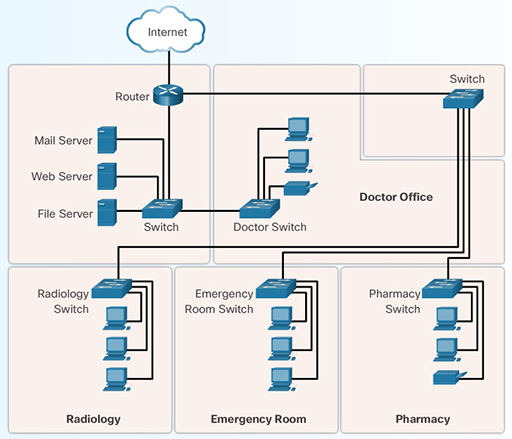
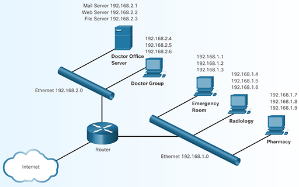
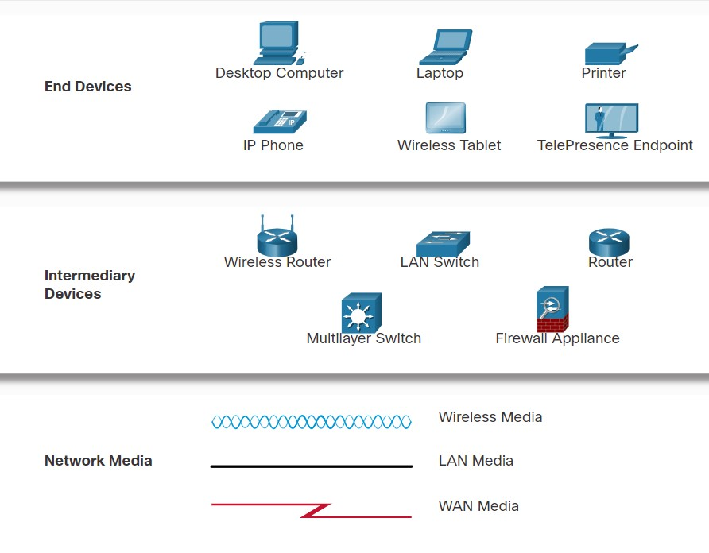

# 130 Fundamentals Networking 

<!-- use Alt + Z para ver tabla correctamente(View > Word Wrap): -->

| Networking Essentials                             | CCST Topics:                                                          |
| ------------------------------------------------- | --------------------------------------------------------------------- |
| __1: Communication in a Connected World__         | 1.3.1 Differentiate between LAN, WAN, MAN, CAN, PAN, and WLAN.        |
|                                                   | 1.3.2 Physical topologies                                             |
| * LAN vs WAN                                      | 1.3.3 Logical network topologies.                                     |
| * Bit                                             | 1.2. Differentiate between bandwidth and throughput.                  |
| * Bandwidth                                       | 1.2 Latency                                                           |
| * Throughput                                      | 1.2 Delay (30.2.7)                                                    |
|                                                   | 1.2 Speed test(30.2.7) vs. Iperf (37.5.5)                             |
|                                                   |                                                                       |
| __5: Communication Principles__                   |                                                                       |
| * TCP/IP model                                    | 1.1. Identify the fundamental conceptual building blocks of networks. |
| * OSI model                                       | 1.1 TCP/IP model                                                      |
| 22.1.1 Video - Data Encapsulation                 | 1.1 OSI model                                                         |
| > *Preguntas / presentaciones*                    | 1.1 frames and packets                                                |
|                                                   | 1.1 addressing                                                        |
|                                                   |                                                                       |

## [ ] 1.3. Differentiate between LAN, WAN, MAN, CAN, PAN, and WLAN.

|      |                             |                                                           |
| ---- | --------------------------- | --------------------------------------------------------- |
| LAN  | Local Area Network          | Pertenece a un solo duen'o, limitado a un area geografica |
| WAN  | Wide Area Network           | Conjunto de redes de uso colectivo                        |
| MAN  | Metropolitan Area Network   | A Nivel de ciudad                                         |
| CAN  | Controller Area Network     | used in vehicle components                                |
| PAN  | Personal Area Network       | Personal (10m o menos)                                    |
| WLAN | Wireless Local Area Network | Wireless= Pertenece a un solo duen'o                      |
|      |                             |                                                           |

__SOHO__: Small Office and Home Office Networks

## [ ] 1.3 Physical topologies

> Muestra ubicacion y connectiones fisicas:



## [ ] 1.3 Logical network topologies.   

> Muestra Disen'o y configuracion logica(virtual):



## [ ] 1.2. Differentiate between bandwidth and throughput.    
[ ] 1.2 Latency                                                          
[ ] 1.2 Delay (30.2.7)  

1 byte = 8 bits

> __Ejemplo manguera__

* Bandwidth: 
    - is the capacity at which a medium can carry data.
    
* Latency: 
    - Amount of time, including delays, for data to travel from one given point to another
    
* Throughput: 
    - The measure of the transfer of bits across the media over a given period of time
    
* Goodput: 
    - The measure of usable data transferred over a given period of time

                                                 
## [ ] 1.2 Speed test(30.2.7) vs. Iperf (37.5.5)   

> Lab demostration:                      

```sh (Linux machine)
sudo apt install iperf
# install iperf in you Linux machine
iperf -s 
# Run iperf as server
iperf -c 10.10.0.202 -p 5001
# Run iperf as client using ip address "10.10.0.202" as server, using port 5001
iperf -c 10.10.0.202 -R
# Run iperf as client in reverse route, using ip address "10.10.0.202" as server
```                   

```bat (WIN Machine)
dir
:: ver directory
cd 
:: change directory
cd.. 
:: go back on the directory

iperf.exe -s 
:: runn as server
iperf.exe -c 10.10.0.202 -p 5001
:: Run iperf as client using ip address "10.10.0.202" as server, using port 5001
iperf.exe -c <ip del server> -R
:: runn as client reverse route
```

# Devices & Media




    - Printing
    - Bluetooth data transmition

* End devices        

                                                                         
## [ ] 1.1. Identify the fundamental conceptual building blocks of networks.
[ ] 1.1 TCP/IP model                                                     
[ ] 1.1 OSI model    
[ ] 1.1 frames and packets 

| #   | mnemonic | OSI MODEL    | TCP/IP MODEL | *   | DATA UNIT NAME (PDU) | mnemonic     |
| --- | -------- | ------------ | ------------ | --- | -------------------- | ------------ |
| 7   | aviso    | App          |              | *   |                      |              |
| 6   | previo   | Presentation | App          | *   | Data                 | Dificilmente |
| 5   | sin      | Session      |              | *   |                      |              |
| 4   | trabajan | Transport    | Transport    | *   | Segment              | Salir        |
| 3   | no       | Network      | Network      | *   | Packet               | Parecen      |
| 2   | datos    | Data-link    | Data-link    | *   | Frames               | Flamantes    |
| 1   | pendejos | Physical     | Data-link    | *   | Bits                 | Bigotes      |

                                              
# [ ] 1.1 addressing


