### Week 2
Module 35: Cisco Switches and Routers                                                 
Module 2: Network Components, Types, and Connections                   
Module 6: Network Media

# 140 Physical Layer
<!-- use Alt + Z para ver tabla correctamente:(View > Word Wrap) -->

| Networking Essentials                             | CCST topics:                                                     |
| ------------------------------------------------- | ---------------------------------------------------------------- |
| __Module 35: Cisco Switches and Routers__         | 4.1.0 Identify the status lights on a device.                    |
| * Identify ports on network devices.              | 4.1.1 Link light color and status (blinking or solid)            |
| * switches and routers                            | 4.2.0 Use a network diagram (attach the appropriate cables.)     |
| * Cut-Through Switching                           | 4.2.1 Patch cables                                               |
| * Switch Boot Process                             | 4.2.2 switches and routers                                       |
|                                                   | 4.2.3 small topologies                                           |
|                                                   | 4.2.4 power                                                      |
|                                                   | 4.2.5 rack layout                                                |
|                                                   | 4.3.0 Identify the various ports on network devices.             |
|                                                   | 4.3.1 Console port                                               |
|                                                   | 4.3.2 serial port                                                |
|                                                   | 4.3.3 fiber port                                                 |
|                                                   | 4.3.4 Ethernet ports                                             |
|                                                   | 4.3.5 SFPs - Small Form-factor Pluggable                         |
|                                                   | 4.3.6 USB port                                                   |
|                                                   | 4.3.7 PoE - Power over Ethernet                                  |
|                                                   |                                                                  |
| __2: Network Components, Types, and Connections__ | 3.3.0 Describe endpoint devices.                                 |
| * Client vs server                                | 3.3.1 Internet of Things (IoT) devices                           |
| * Peer-to-peer                                    | 3.3.2 computers                                                  |
| * End devices                                     | 3.3.3 mobile devices                                             |
| * Intermediate devices                            | 3.3.4 IP Phone                                                   |
| * Network media                                   | 3.3.5 printer                                                    |
| > Install packet tracer, basic navigation         | 3.3.6 server                                                     |
|                                                   |                                                                  |
| __06: Network Media__                             | 3.1.0 Identify cables and connectors commonly used               |
| * Metal wires within cables                       | 3.1.1 Cable types: fiber, copper, twisted pair;                  |
| > Twisted-Pair Cable                              | 3.1.2 Connector types: coax, RJ-45, RJ-11, fiber connector types |
| > Coaxial Cable                                   |                                                                  |
| * Glass or plastic fibers within cables           |                                                                  |
| * Wireless transmission                           |                                                                  |
| > *Preguntas / presentaciones*                    |                                                                  |
|                                                   |                                                                  |

### When choosing a switch, there are a number of factors to consider, including the following:

* Type of ports - copper, fiber
* Speed required - 10, 100
* Expandability - modules
* Manageability - configurable


# Power over Ethernet (PoE) - device types can be directly powered from the switch

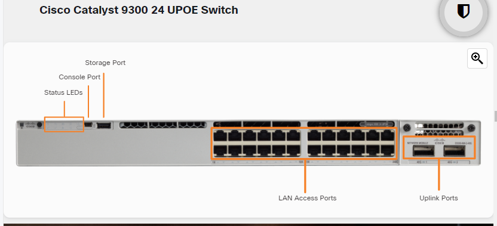


## 35.2.1 Frame Forwarding Methods on Cisco Switches

- __Store-and-forward switching:__ Swicth computes the CRC. CRC uses a mathematical formula, based on the number of bits (1s) in the frame, to __determine whether the received frame has an error__. If the CRC is valid the frame is forwarded out of the correct port.
- __Cut-through switching__ forwards the frame before it is entirely received. At a minimum, the destination address of the frame must be read before the frame can be forwarded.
    * __Fast-forward switching:__ immediately forwards a packet after reading the destination address. Fast-forward switching is the typical cut-through method of switching.
    * __Fragment-free switching__ In fragment-free switching, the switch stores the __first 64 bytes__ of the frame before forwarding. The reason fragment-free switching stores only the first 64 bytes of the frame is that most network errors and collisions occur during the first 64 bytes. 


# Duplex and Speed Settings

* Full-duplex - Both ends of the connection can send and receive simultaneously.
* Half-duplex - Only one end of the connection can send at a time.

### Auto-MDIX (Medium-dependent interface)

the Device identifies the correct cable type required to interconnect switch-to-switch, switch-to-router, switch-to-host, or router-to-host devices. A crossover cable is used when connecting like devices, and a straight-through cable is used for connecting unlike devices.


# 35.3.1 Power Up the Switch (Components)

When the switch is on, the power-on self-test (POST) begins. During POST, the LEDs blink while a series of tests determine that the switch is functioning properly.

POST is completed when the SYST LED rapidly blinks green. If the switch fails POST, the SYST LED turns amber. When a switch fails POST, it is necessary to return the switch for repairs.

### Step 1. Check the components.
Ensure all the components that came with the switch are available. These could include a console cable, power cord, Ethernet cable, and switch documentation.

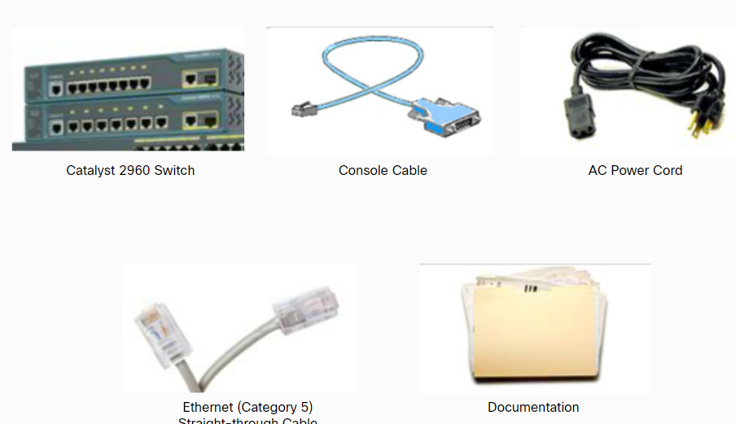

### Step 2. Connect the cables to the switch.
Connect the PC to the switch with a console cable and start a terminal emulation session. Connect the AC power cord to the switch and to a grounded AC outlet.
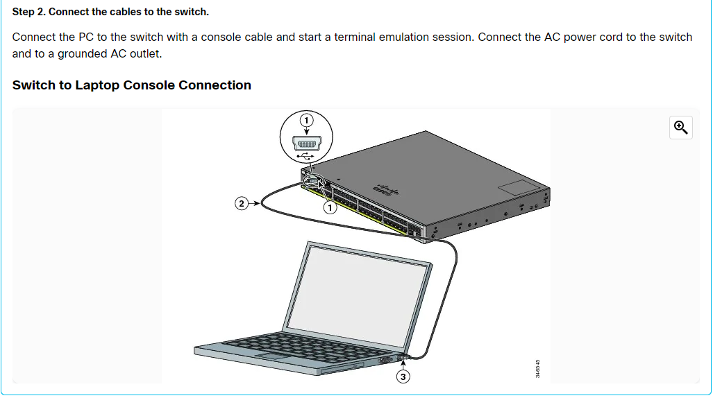

## Step 3. Power up the switch.
Some Cisco switch models do not have an on/off switch, like the Cisco Catalyst 9300 48S switch shown in the figure. To power on the switch, plug one end of the AC power cord into the switch AC power connector, and plug the other end into an AC power outlet.

Note: The Cisco Catalyst 9300 switch in the figure has redundant power supplies in case one fails.
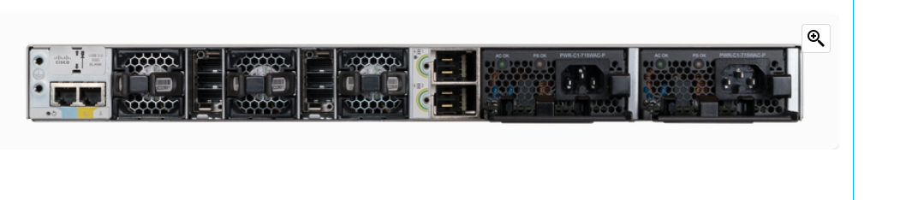


# In-Band vs Out-of-Band Device Management


# 35.3.3 IOS Startup Files

Cisco device loads the following two files into RAM when it is booted:

* __IOS image file__ - The IOS facilitates the basic operation of the device’s hardware components. The IOS image file is stored in flash memory.
* __Startup configuration file__ - The startup configuration file contains commands that are used to initially configure a router and switch and create the running configuration file stored in RAM. The startup configuration file is stored in NVRAM. All configuration changes are stored in the running configuration file and are implemented immediately by the IOS.
    - __RAM__ -  Random-access memory - Temporal mientras el device esta ON
    - __NVRAM__ - Non-volatile random-access memory - Info saved on the device

# 35.4.1 Video - Cisco Router Components


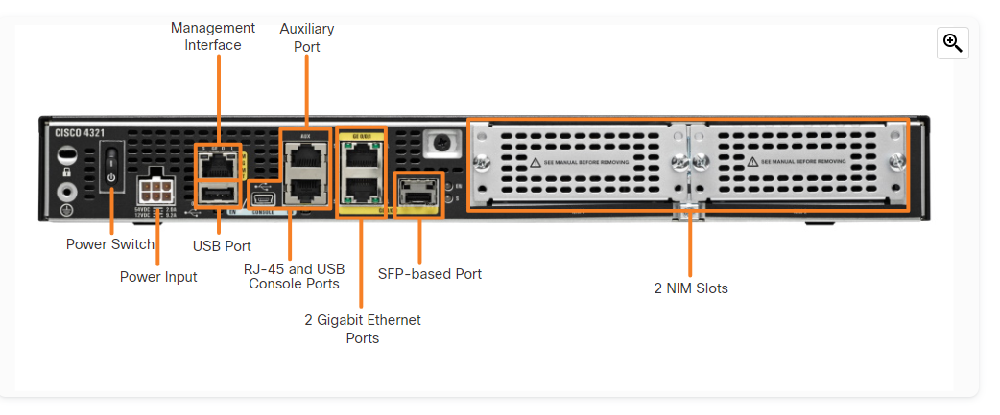

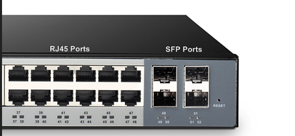


__Console__ - Uses a low speed serial or USB connection to provide direct connect, out-of-band management access to a Cisco device.

__AUX port__ - Used for remote management of the router using a dial-up telephone line and modem.

__Small Form-factor Pluggable__ is a compact, hot-pluggable network interface. Faster that regular RJ45 and Fiber connections

__Serial ports__

__PoE - Power over Ethernet__

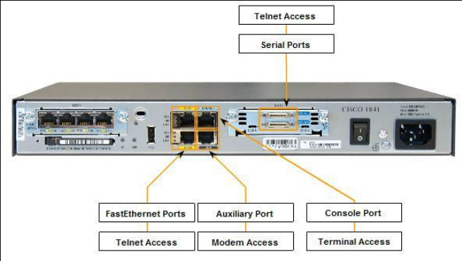

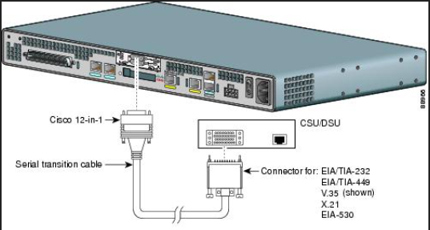

# 35.5.1 Power Up the Router


Step 1. Securely mount the device to the rack.
Note: The figure shows a typical scenario of mounting the chassis in a rack.
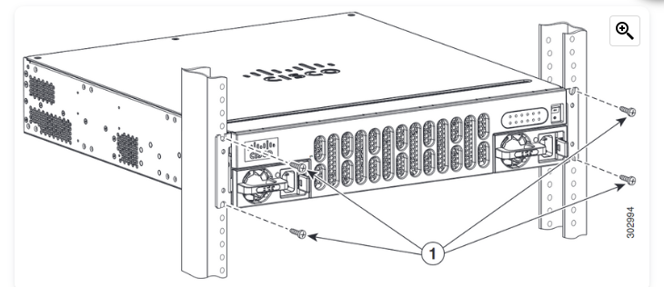

Step 2. Ground the device.

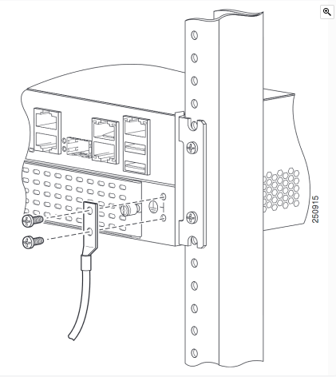

Step 3. Connect the power cable.

Step 4. Connect a console cable.

Step 5. Turn on the router.

Step 6. Observe the startup messages on the laptop as the router boots up.


## Client vs Server:

```
             ┌──────────┐
  ┌──────────┤ INTERNET ├───────────┐
  │          └──────────┘           │
┌─┴──┐                           ┌──┴───┐
│ PC │                           │SERVER│
└────┘                           └──────┘
```

| Type | Server Description                             |
| ---- | ---------------------------------------------- |
| File | Access files using a protocol like:            |
|      | FTP (File Transfer Protocol) port 21           |
|      |                                                |
| Web  | Provides web resources using these protocols:  |
|      | Hypertext Transfer Protocol (HTTP) TCP port 80 |
|      | Secure HTTP (HTTPS) TCP port 443               |
|      |                                                |
| Mail | Email messages are stored in databases         |
|      | Simple Mail Transfer Protocol (SMTP) 161       |
|      | Post Office Protocol (POP) 110                 |
|      | Internet Message Access Protocol (IMAP) 143    |

## Peer-to-peer       
* The simplest P2P network consists of two directly connected computers using either a wired or wireless connection. Both computers are then able to use this simple network to exchange data and services with each other, acting as __either a client or a server as necessary__


            
> __142_LAB Internet of Things (IoT) Packet tracer - 142_LAB_IoT.pkt__

## [ ] 3.1. Identify cables and connectors commonly used             
- [ ] 3.1 Cable types: fiber, copper, twisted pair;                 
- [ ] 3.1 Connector types: coax, RJ-45, RJ-11, fiber connector types

## Three Media Types

### __Metal wires within cables__ - Data is encoded into electrical impulses.

* EMI: ElectroMagnetic Interference  
* RFI: Radio Frequency Interference 

- __Twisted-Pair Cable__:
 * Cable de Red: RJ45 cable connector(Ethernet cable)
* RJ-11 Cable (telefono)
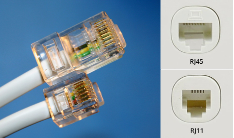


### __Coaxial Cable__
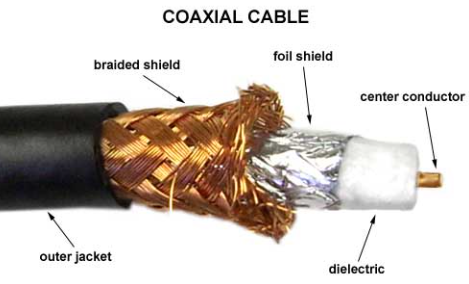

### __Glass or plastic fibers within cables__ 
  * large distance
  * Expensive 
  * (fiber-optic cable) - Data is encoded into pulses of light.
    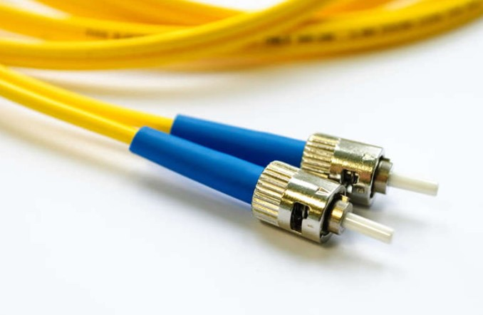
    
### Wireless transmission - Data is encoded via modulation of specific frequencies of electromagnetic waves.
* WIFI (802.11)

* IEEE
    > Institute for Electrical and Electronic Engineers 
* ISO
    > International Organizations for Standardization 

---

## Ethernet Straight-through 
The most common type of networking cable. It is commonly used to interconnect a host to a switch and a switch to a router. 	__Both ends T568A or both ends T568B__

## Ethernet Crossover
A cable used to interconnect similar devices. For example, to connect a switch to a switch, a host to a host, or a router to a router. However, crossover cables are now considered legacy as NICs use medium-dependent interface crossover (auto-MDIX) to automatically detect the cable type and make the internal connection. 	__One end T568A, other end T568B__


```ios
Switch(config)# interface gigabitethernet1/0/1
Switch(config-if)# mdix auto
Switch(config-if)# end
```

<!-- use Alt + Z para ver tabla correctamente:(View > Word Wrap) -->
| Cable Type       | Standard                           | Application                                            |
| ---------------- | ---------------------------------- | ------------------------------------------------------ |
| Straight-through | Both ends T568A or both ends T568B | Connects a End device to a network intermediary device |
| Crossover        | One end T568A, other end T568B     | Connects two network intermediary devices              |
| Rollover         | Cisco proprietary                  | Connects a workstation serial port to  console port    |


