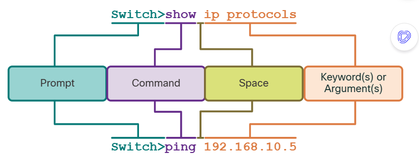

# Week 3
- Module 27: The Cisco IOS Command Line 
- Module 28: Build a Small Cisco Network                                                
- Module 17: Network Testing Utilities
- Packet-tracer lab

<!-- use Alt + Z para ver contenido correctamente(View > Word Wrap): -->

|                                            |                                                                  |
| ------------------------------------------ | ---------------------------------------------------------------- |
| **Module** 27: The Cisco IOS Command Line  | 5.5.0 Run basic show commands on a Cisco network device.         |
| * Primary Command Modes                    | 5.5.1 show run, show cdp neighbors, show ip interface brief      |
| * Hot Keys and Shortcuts                   | 5.5.2 show ip route, show version, show inventory, show switch   |
| * Show Commands                            | 5.5.3 show mac address-table, show interface, show interface x   |
|                                            | 5.5.4 show interface status;                                     |
|                                            | 5.5.5 privilege levels; command help and auto-complete           |
|                                            |                                                                  |
| **Module** 28: Build a Small Cisco Network | 37.5.1                                                           |
| * Basic Switch Configuration               |                                                                  |
| * SSH                                      | 5.4.1 Remote access (RDP, SSH, telnet)                           |
|                                            |                                                                  |
| **Module** 17*: Network Testing Utilities  | 5.3.0 Run basic diagnostic commands and interpret the results.   |
| * ping                                     | 5.3.1 ping                                                       |
| * ipconfig/ifconfig/ip                     | 5.3.2 ipconfig/ifconfig/ip                                       |
|                                            | 5.3.3 tracert/traceroute                                         |
|                                            | 5.3.4 nslookup; recognize how firewalls can influence the result |
|                                            |                                                                  |


## Module 27: The Cisco IOS Command Line 

- [ ] 27.1.6 Syntax Checker - Navigate Between IOS Modes
- [ ] 27.2.1 Basic IOS Command Structure

    


Packet Tracer Labs:

- [ ] 27.2.6 Packet Tracer - Navigate the IOS
- [ ] 27.3.3 Packet Tracer - Use Cisco IOS Show Commands


## Module 28: Build a Small Cisco Network 

- [ ] 28.1.3 Syntax Checker - Configure a **Switch** Virtual Interface
- [ ] 28.1.4 Packet Tracer - Implement Basic Connectivity

- [ ] 28.2.3 Syntax Checker - Configure Initial **Router** Settings
- [ ] 28.2.4 Packet Tracer - Configure Initial Router Settings

- [ ] 28.3.4 Syntax Checker - Configure **SSH**
- [ ] 28.3.6 Packet Tracer - Configure SSH

- [ ] 28.4.3 Syntax Checker - Configure the Default Gateway

- [ ] 28.4.4 Packet Tracer Tutored Activity - Build a Switch and Router Network

- [ ] 28.4.5 Packet Tracer - Troubleshoot Default Gateway Issues


# Module 17*: __Network Testing Utilities:__

> Run basic diagnostic commands and interpret the results:

* cmd or cisco ios cli commands:

```bat
ping [host ip address]
: Test host reachability

ipconfig/ifconfig/ip 
: windows command used to display the current IP configuration information for a host.            

ipconfig /all 
: windows command. displays additional information including the MAC address, IP addresses of the default gateway, and the DNS servers. It also indicates if DHCP is enabled, the DHCP server address, and lease information.    


tracert 8.8.8.8
: tracert/traceroute 
: shows path to the destination

nslookup youtube.com
: shows DNS (Domain-name) information
```

- [ ] 17.1.3 Packet Tracer - Use the ipconfig Command

- [ ] 17.1.6 Packet Tracer - Use the ping Command
