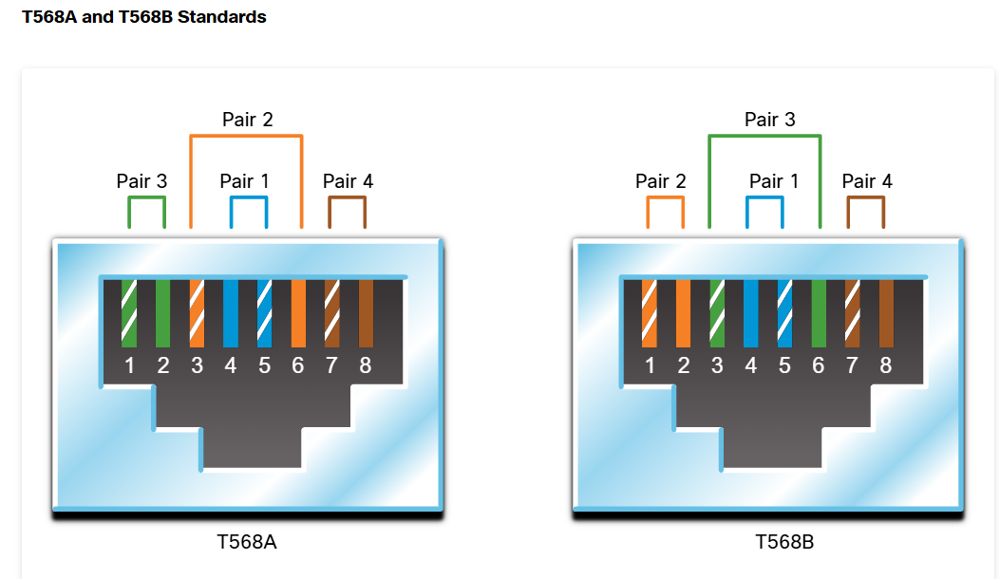
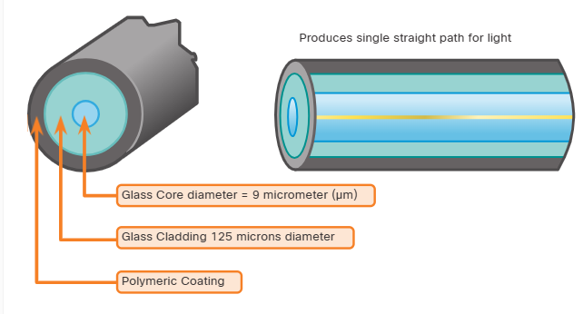
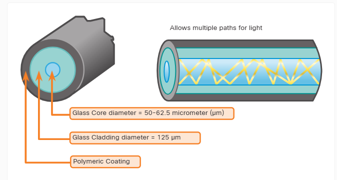

### Week 4
- Module 5: Communication Principles                                              
- Module 30: Physical Layer            
- Module 20: Number Systems

|                                        |                                                                           |
| -------------------------------------- | ------------------------------------------------------------------------- |
| **Module 5:** Communication Principles |                                                                           |
| * TCP/IP model                         | 1.1. Identify the fundamental conceptual building blocks of networks.     |
| * OSI model                            | 1.1 TCP/IP model                                                          |
| 22.1.1 Video - Data Encapsulation      | 1.1 OSI model                                                             |
| > *Preguntas / presentaciones*         | 1.1 frames and packets                                                    |
|                                        | 1.1 addressing                                                            |
|                                        |                                                                           |
| **Module 30:** Physical Layer          | 3.1. Identify cables and connectors commonly used in local area networks. |
| * Unshielded twisted-pair (UTP)        | 3.1 Cable types: fiber, copper, twisted pair;                             |
| * Shielded Twisted-Pair (STP)          | 3.1 Connector types: coax, RJ-45, RJ-11, fiber connector types            |
| * Straight-through vs Crossover        |                                                                           |
| * Single-Mode Fiber                    |                                                                           |
| * Multimode Fiber                      |                                                                           |
| > *30.4.4 Activity - Cable Pinouts*    |                                                                           |
|                                        |                                                                           |
| **Module 20:** Number Systems          |                                                                           |
| * Binary                               |                                                                           |
| * Decimal                              |                                                                           |
| * Hexadecimal                          |                                                                           |
| > *Convertions practice*               |                                                                           |


# Module 5: Communication Principles 

## [ ] 1.1. Identify the fundamental conceptual building blocks of networks.

- TCP/IP model                                                     

- OSI model    

- frames and packets 


| #   | mnemonic | OSI MODEL    | TCP/IP MODEL | *   | DATA UNIT NAME (PDU) | mnemonic     |
| --- | -------- | ------------ | ------------ | --- | -------------------- | ------------ |
| 7   | aviso    | App          |              | *   |                      |              |
| 6   | previo   | Presentation | App          | *   | Data                 | Dificilmente |
| 5   | sin      | Session      |              | *   |                      |              |
| 4   | trabajan | Transport    | Transport    | *   | Segment              | Salir        |
| 3   | no       | Network      | Network      | *   | Packet               | Parecen      |
| 2   | datos    | Data-link    | Data-link    | *   | Frames               | Flamantes    |
| 1   | pendejos | Physical     | Data-link    | *   | Bits                 | Bigotes      |

                                              
### [ ] 1.1 addressing


# Module 30: Physical Layer  
- 3.1 Identify cables and connectors commonly used in local area networks
- 3.1 Cable types: fiber, copper, twisted pair;                           
- 3.1 Connector types: coax, RJ-45, RJ-11, fiber connector types          

## Ethernet Straight-through 
The most common type of networking cable. It is commonly used to interconnect a host to a switch and a switch to a router. 	__Both ends T568A or both ends T568B__

## Ethernet Crossover
A cable used to interconnect similar devices. For example, to connect a switch to a switch, a host to a host, or a router to a router. However, crossover cables are now considered legacy as NICs use medium-dependent interface crossover (auto-MDIX) to automatically detect the cable type and make the internal connection. 	__One end T568A, other end T568B__


```ios
Switch(config)# interface gigabitethernet1/0/1
Switch(config-if)# mdix auto
Switch(config-if)# end
```

<!-- use Alt + Z para ver tabla correctamente:(View > Word Wrap) -->

| Cable Type       | Standard                           | Application                                            |
| ---------------- | ---------------------------------- | ------------------------------------------------------ |
| Straight-through | Both ends T568A or both ends T568B | Connects a End device to a network intermediary device |
| Crossover        | One end T568A, other end T568B     | Connects two network intermediary devices              |
| Rollover         | Cisco proprietary                  | Connects a workstation serial port to  console port    |


## Fiber-optic cables are broadly classified into two types:

* Single-mode fiber (SMF)

* Multimode fiber (MMF)



# Number Systems

|                               |
| ----------------------------- |
| **Module 20:** Number Systems |
| * Binary                      |
| * Decimal                     |
| * Hexadecimal                 |
| > *Convertions practice*      |
|                               |

## IPv4

<!-- use el tab para moverse en las celdas de la tabla -->
<!-- Como comprar en tienditas(TUKIS): -->

11000111 = 199

| 128 | 64  | 32  | 16  | 8   | 4   | 2   | 1   |
| --- | --- | --- | --- | --- | --- | --- | --- |
| 1   | 1   | 0   | 0   | 0   | 1   | 1   | 1   |

128+64+4+2+1 = 199


## Practice

| 128 | 64  | 32  | 16  | 8   | 4   | 2   | 1   |
| --- | --- | --- | --- | --- | --- | --- | --- |
|     |     |     |     |     |     |     |     |

| decimal | binario  |
| ------- | -------- |
| 12      |          |
| 36      |          |
| 231     |          |
| 56      |          |
|         | 01010101 |
|         | 00111110 |
|         | 01111001 |

## Practice

| decimal     | binario                             |
| ----------- | ----------------------------------- |
| 172.16.0.20 |                                     |
|             | 11000000.10101000.00101110.00000011 |
|             | 10111010.01100001.00000110.00100100 |
| 169.23.67.2 |                                     |


### binary-game
> https://learningnetwork.cisco.com/s/binary-game


## IPv6 > HEX

2001:0db8:85a3:0000:0000:8a2e:0370:7334

HEX: AF >>> Binario:10101111 >> decimal: 175

| 128 | 64  | 32  | 16  | 8   | 4   | 2   | 1   |
| --- | --- | --- | --- | --- | --- | --- | --- |
|     |     |     |     |     |     |     |     |
|     |     |     |     |     |     |     |     |

AF

AF > 
A                         F
| 128 | 64  | 32  | 16  | 8   | 4   | 2   | 1   |
| --- | --- | --- | --- | --- | --- | --- | --- |
| 1   | 0   | 1   | 0   | 1   | 1   | 1   | 1   |


F                        A
| 128 | 64  | 32  | 16  | 8   | 4   | 2   | 1   |
| --- | --- | --- | --- | --- | --- | --- | --- |
| 1   | 1   | 1   | 1   | 1   | 0   | 1   | 0   |

| Denary | Binary | Hex |
| ------ | ------ | --- |
| 0      | 0000   | 0   |
| 1      | 0001   | 1   |
| 2      | 0010   | 2   |
| 3      | 0011   | 3   |
| 4      | 0100   | 4   |
| 5      | 0101   | 5   |
| 6      | 0110   | 6   |
| 7      | 0111   | 7   |
| 8      | 1000   | 8   |
| 9      | 1001   | 9   |
| 10     | 1010   | A   |
| 11     | 1011   | B   |
| 12     | 1100   | C   |
| 13     | 1101   | D   |
| 14     | 1110   | E   |
| 15     | 1111   | F   |

## Practice:

| Denary | Binary | Hex |
| ------ | ------ | --- |
| 252    |        |     |
| 172    |        |     |
| 92     |        |     |
|        |        | 3D  |
|        |        | D4  |
|        |        | 31  |

