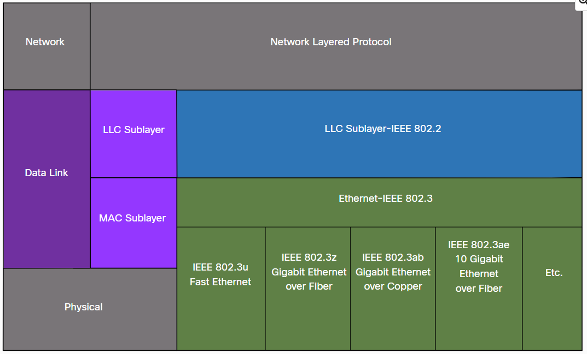
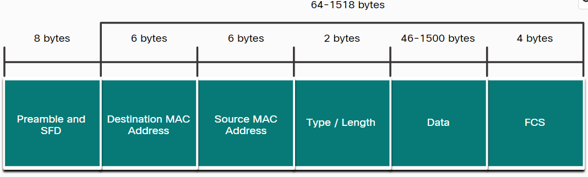
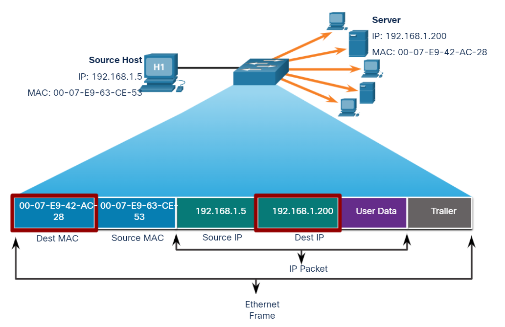
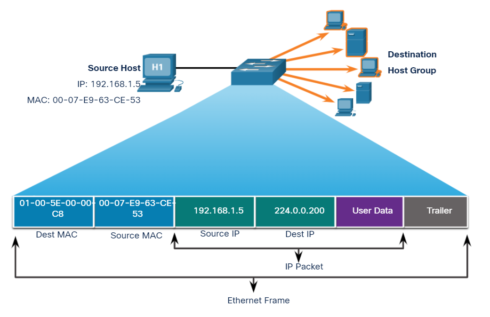
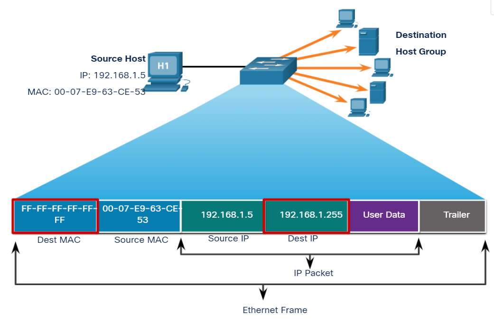

### Week 5
- Module 31: Data Link Layer             
- Module 21: Ethernet Switching

# 050 Data Link Layer

 <!-- use Alt + Z para ver contenido correctamente(View > Word Wrap): -->

| __050 Data Link Layer__                             |                                        |
| --------------------------------------------------- | -------------------------------------- |
| **Module 7**: The Access Layer                      | 1.1.3 frames and packets               |
| * Ethernet Frame fields                             | 1.1.4 addressing                       |
| * MAC Address Tables                                |                                        |
|                                                     |                                        |
| **Module 21**: Ethernet Switching                   | 4.5.0 Explain basic switching concepts |
| * Ethernet Frames                                   | 4.5.1 MAC address tables               |
| * Switch Learning and Forwarding                    |                                        |
| > *21.2.6 Lab - View Captured Traffic in Wireshark* |                                        |
|                                                     |                                        |
| **Module 31**:  Data Link Layer                     | 1.3.1 Physical topologies              |
| * Half Duplex vs Full Duplex                        | 1.3.2 Logical network topologies       |
| * CSMA/CD  vs CSMA/CA                               |                                        |

> * Physical and logical topologies (31.1.1 Physical and Logical Topologies)
> * Topologies types


## Full-duplex communication (Autopista multi carril)
Both devices can simultaneously transmit and receive on the shared media.

## Half-duplex communication (Tren)
Both devices can transmit and receive on the media but cannot do so simultaneously.

```ios
Switch(config)#inter fastEthernet 0/1
Switch(config-if)#duplex full 
```
# CSMA/CD vs CSMA/CA

* Carrier Sense Multiple Access/Collision *Detection* (__CSMA/CD__) 
* Carrier Sense Multiple Access/Collision *Avoidance* (__CSMA/CA__) 

## 21.1.3 Ethernet Addressing

Packet tracer

## Ethernet Standards in the MAC Sublayer



Recall that LLC and MAC have the following roles in the data link layer:

### LLC Sublayer
This IEEE 802.2 sublayer communicates between the networking software at the upper layers and the device hardware at the lower layers. It places information in the frame that identifies which network layer protocol is being used for the frame. This information allows multiple Layer 3 protocols, such as IPv4 and IPv6, to use the same network interface and media.

### MAC Sublayer
This sublayer (IEEE 802.3, __802.11__, or 802.15 for example) is implemented in hardware and is responsible for data encapsulation and media access control. It provides data link layer addressing and is integrated with various physical layer technologies.

## Ethernet Frame Fields



### Preamble and Start Frame Delimiter Fields 
The Preamble (7 bytes) and Start Frame Delimiter (__SFD__), also called the Start of Frame (1 byte), fields are used for synchronization between the sending and receiving devices. These first eight bytes of the frame are used to get the attention of the receiving nodes. __Essentially, the first few bytes tell the receivers to get ready to receive a new frame.__ 

### Destination MAC Address Field 
This 6-byte field is the identifier for the intended recipient. As you will recall, this address is used by Layer 2 to assist devices in determining if a frame is addressed to them. The address in the frame is compared to the MAC address in the device. If there is a match, the device accepts the frame. Can be a unicast, multicast or broadcast address. 

### Source MAC Address Field 
This 6-byte field identifies the originating NIC or interface of the frame. 

### Type / Length 
This 2-byte field __identifies the upper layer protocol__ encapsulated in the Ethernet frame. Common values are, in hexadecimal, Ox800 for IPv4, 0x86DD for IPv6 and 0x806 for ARP.: You may also see this field referred to as EtherType, Type, or Length. 

### Data Field 
This field (46 - 1500 bytes) contains the encapsulated data from a higher layer, which is a generic Layer 3 PDU, or more commonly, an IPv4 packet. All frames must be at least 64 bytes long. If a small packet is encapsulated, additional bits called a pad are used to increase the size of the frame to this minimum size. 

### Frame Check Sequence Field 
The Frame Check Sequence (FCS) field (4 bytes) is **used to detect errors in a frame.** It uses a __cyclic redundancy check (CRC)__. The sending device includes the results of a CRC in the FCS field of the frame. The receiving device receives the frame and generates a CRC to look for errors. If the calculations match, no error occurred. Calculations that do not match are an indication that the data has changed; therefore, the frame is dropped. A change in the data could be the result of a disruption of the electrical signals that represent the bits. 


## 21.2.6 Lab - View Captured Traffic in Wireshark

The world's most popular network protocol analyzer


## 21.3.1 MAC Address and Hexadecimal

* Ethernet MAC address consists of a 48-bit binary value. 

#### 0002.4A05.293C

| 00:02:4A | 05:29:3C |
| -------- | -------- |
| vendor   | device   |

- first 24-bits vendor
- second 24-bits device

# Unicast MAC Address




# 21.3.4 Multicast MAC Address
- There is a destination MAC address of 01-00-5E when the encapsulated data is an IPv4 multicast packet and a destination MAC address of 33-33 when the encapsulated data is an IPv6 multicast packet.
- The range of IPv4 multicast addresses is __224.0.0.0__ to 239.255.255.255. The range of IPv6 multicast addresses begins with ff00::/8.




## 21.3.3 Broadcast MAC Address



