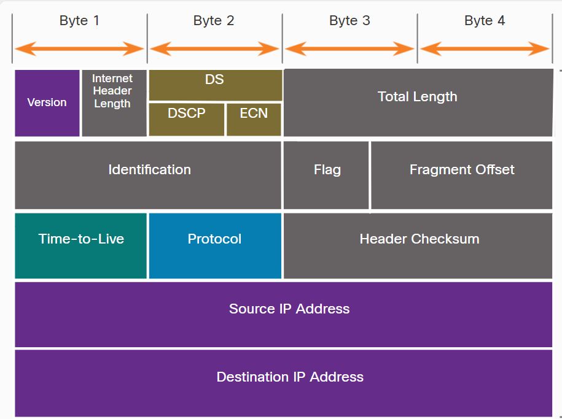
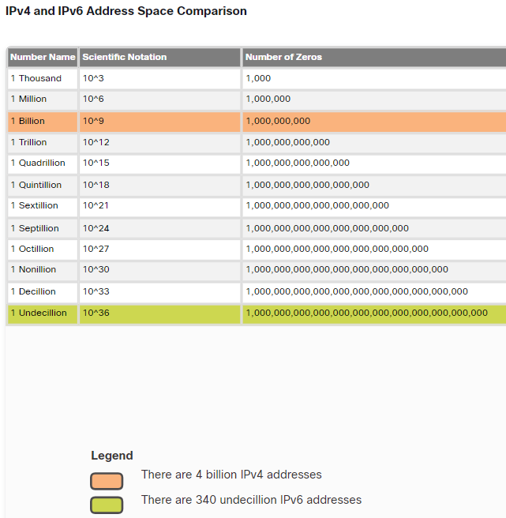
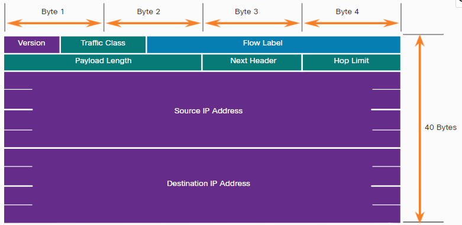
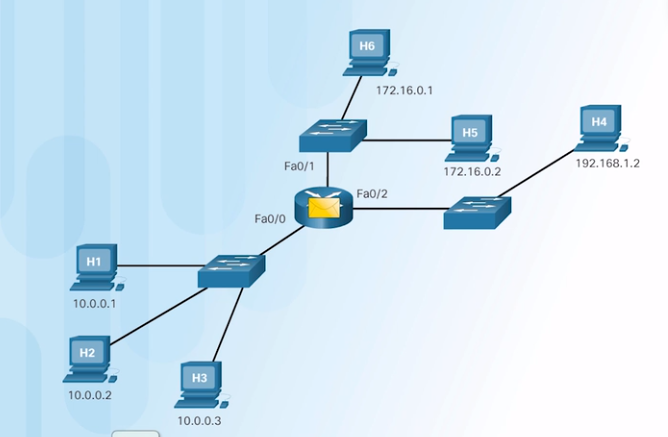
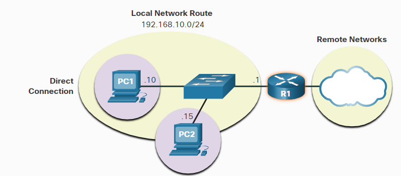

### Week 6
- Module 22: Network Layer 
- Module 12: Gateways to Other Networks                                              
- Module 14: Routing Between Networks                                              
- Module 32: Routing at the Network Layer


| __Routing Concepts__                             |                                        |
| ------------------------------------------------ | -------------------------------------- |
| Module 22*: Network Layer                        |                                        |
| * IPv4 Packet Header                             |                                        |
| * IPv6 Packet Header                             |                                        |
|                                                  |                                        |
| Module 12: Gateways to Other Networks            | 2.1.0 Private vs Public addresses.     |
| * Default Gateway                                | 2.1.1 Address classes                  |
| * NAT                                            | 2.1.2 NAT concepts                     |
|                                                  |                                        |
| Module 14: Routing Between Networks              | 4.4.0 Explain basic routing concepts.  |
| * Routing table                                  |                                        |
| * Router Packet Forwarding                       |                                        |
|                                                  |                                        |
| Module 32: Routing at the Network Layer          | 4.4.0 Explain basic routing concepts.  |
| * Routing Table                                  | 4.4.1 Default gateway                  |
| * Host Forwarding Decision                       | 4.4.2 layer 2 vs. layer 3 switches     |
| * Static Routing Configuration                   | 4.4.3 local network vs. remote network |
| * Dynamic Routing                                |                                        |
|                                                  |                                        |
| __*12-14 Exam: Communication Between Networks*__ |                                        |


# 081 IPv4 & IPv6  - Module 22*: Network Layer 


## These are the basic characteristics of IP:

* __Connectionless__ - There is no connection with the destination established before sending data packets.
* __Best Effort__ - IP is inherently unreliable because packet delivery is not guaranteed.
* __Media Independent__ - Operation is independent of the medium (i.e., copper, fiber-optic, or wireless) carrying the data.


# IPv4 Packet Header



Significant fields in the IPv4 header include the following:

### Version:
Contains a 4-bit binary value set to 0100 that identifies this as an IPv4 packe
### Differentiated Services or DiffServ (DS):
Formerly called the type of service (ToS) field, the DS field is an 8-bit field __used to determine the priority__ of eacpacket. The six most significant bits of the DiffServ field are the differentiated services code point (DSCP) bits and the last two bits are the explicit congestion notification (ECN) bits.
### Time to Live (TTL):
TTL contains an 8-bit binary value that is used to limit the lifetime of a packet. The source device of the IPvpacket sets __the initial TTL value. It is decreased by one each time the packet is processed by a router.__ If the TTL field decrements to zero, the router discards the packet and sends an Internet Control Message Protocol (ICMP) Time Exceeded message to the source IP address. Because the router decrements the TTL of each packet, the router must also recalculate the Header Checksum.
### Protocol:
This field is used to identify the next level protocol. This 8-bit binary value indicates the data payload type thathe packet is carrying, which enables the network layer to pass the data to the appropriate upper-layer protocol. Common values include ICMP (1), TCP (6), and UDP (17).
### Header Checksum: 
This is used to __detect corruption__ in the IPv4 heade
### Source IPv4 Address:
This contains a 32-bit binary value that represents the source IPv4 address of the packet. The source IPv4 address ialways a unicast address.
### Destination IPv4 Address:
This contains a 32-bit binary value that represents the destination IPv4 address of the packet. The destination IPvaddress is a unicast, multicast, or broadcast address.


# IPv6 

## IPv4 and IPv6 Address Space Comparison:


## IPv6 Packet Header


The fields in the IPv6 packet header include the following:

* __Version__ - This field contains a 4-bit binary value set to 0110 that identifies this as an IP version 6 packet.

* __Traffic Class__ - This 8-bit field is equivalent to the IPv4 Differentiated Services (DS) field.

* __Flow Label__ - This 20-bit field suggests that all packets with the same flow label receive the same type of handling by routers.

* __Payload Length__ - This 16-bit field indicates the length of the data portion or payload of the IPv6 packet. This does not include the length of the IPv6 header, which is a fixed 40-byte header.

* __Next Header__ - This 8-bit field is equivalent to the IPv4 Protocol field. It indicates the data payload type that the packet is carrying, enabling the network layer to pass the data to the appropriate upper-layer protocol.

* __Hop Limit__ - This 8-bit field replaces the IPv4 TTL field. This value is decremented by a value of 1 by each router that forwards the packet. When the counter reaches 0, the packet is discarded, and an ICMPv6 Time Exceeded message is forwarded to the sending host,. This indicates that the packet did not reach its destination because the hop limit was exceeded. Unlike IPv4, IPv6 does not include an IPv6 Header Checksum, because this function is performed at both the lower and upper layers. This means the checksum does not need to be recalculated by each router when it decrements the Hop Limit field, which also improves network performance.

* __Source IPv6 Address__ - This 128-bit field identifies the IPv6 address of the sending host.

* __Destination IPv6 Address__ - This 128-bit field identifies the IPv6 address of the receiving host.


# Routing Concepts


### Private address ranges

| Network Address and Prefix | RFC 1918 Private Address Range |
|----------------------------|--------------------------------|
| 10.0.0.0/8                 | 10.0.0.0 - 10.255.255.255      |
| 172.16.0.0/12              | 172.16.0.0 - 172.31.255.255    |
| 192.168.0.0/16             | 192.168.0.0 - 192.168.255.255  |
    
### Loopback address (for testing TCP-IP)
* 127.0.0.0/8 
* 127.0.0.0 to 127.255.255.254

### Link local address
* 169.254.0.0/16
* 169.254.0.1 to 169.254.254.255.254

### Multicast address
* 224.0.0.0/4
* 224.0.0.0 to 239.255.255.255


# Reasons to divide a network into multiple smaller networks.
    - To maintain smaller broadcast domains
    - Large networks are more difficult to troubleshoot.
    - Increase network security


# Router Packet Forwarding




# 14.3.4 Packet Tracer - Create a LAN


# 32.1.1 Host Forwarding Decision


- __Itself:__ 
    A host can ping itself by sending a packet to a special IPv4 address of 127.0.0.1 or an IPv6 address ::1, which is referred to as the loopback interface. Pinging the loopback interface __tests__ the TCP/IP protocol stack on the host.
- __Local host:__ 
    This is a destination host that is on the same local network as the sending host. The source and destination hosts share the same network address.
- __Remote host:__ 
    This is a destination host on a remote network. The source and destination hosts do not share the same network address.

# 32.1.3 A Host Routes to the Default Gateway




On a Windows host:

```bat
route print
: shows routing table in a WIN PC
netstat -r
: shows routing table in a WIN PC, with extra details
```

# Routing theory (how routing table works)

### 1. Directly Connected Networks:

### 2. Remote Networks: 
- Static routes:

```ios
ip route 192.168.10.0 255.255.255.0 fa0/0
! find netowork "192.168.10.0/24" through fa0/0
```

- Dynamic routing protocols (OSPF)

### 3. Default Route(last option): 

```ios
ip route 0.0.0.0 0.0.0.0 fa0/0
! all traffic you dont have specific entries sent it to "fa0/0"
```


# __Administrative Distance (AD):__

```ios
show ip route
! shows ip routing table
```
| Source    | AD  |
| --------- | --- |
| Connected | 0   | 
| Static    | 1   | 
| eBGP      | 20  |
| EIGRP     | 90  |
| IGRP      | 100 |
| OSPF      | 110 |
| IS-IS     | 115 |
| RIP       | 120 |
| iBGP      | 200 |


# Router will use route with smallest subnet mask 


## 239 LAB routing