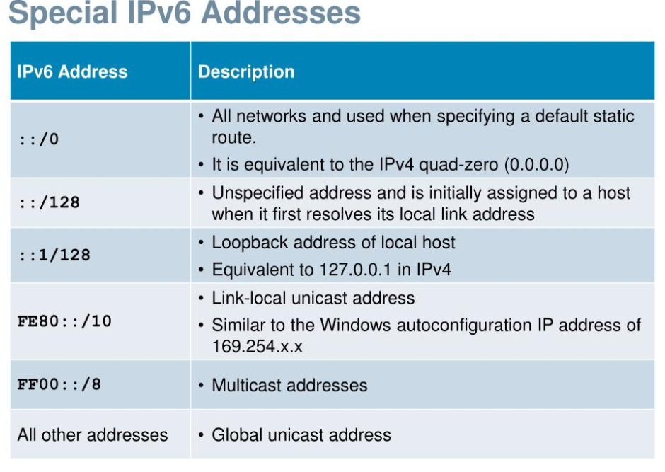
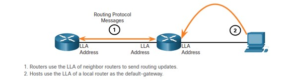

### Week 9 (subnetting 2)
- Module 10: IPv6 Addressing Formats and Rules                                            
- Module 33: IPv6 Addressing 
- Module 34: IPv6 Neighbor Discovery
> Checkpoint Exam: IP Addressing

| __IPv6__                                     |                                                   |
| -------------------------------------------- | ------------------------------------------------- |
| Module 10: IPv6 Addressing Formats and Rules | 2.3.0 Identify IPv6 addresses and prefix formats. |
| * IPv6 Formatting Rules                      | 2.3.1 Types of addresses                          |
|                                              | 2.3.2 Prefix concepts                             |
| Module 33: IPv6 Addressing                   |                                                   |
| * GUA and LLA                                |                                                   |
| * SLAAC vs Stateless                         |                                                   |
|                                              |                                                   |
| Module 34: IPv6 Neighbor Discovery           |                                                   |
| * Neighbor Solicitation                      |                                                   |
|                                              |                                                   |
| __*08-11 Exam: The Internet Protocol*__      |                                                   |
| __*33-34 Exam: IP Addressing*__              |                                                   |

| 8   | 4   | 2   | 1   |
| --- | --- | --- | --- |
| 1   | 1   | 1   | 1   |  > 15

| Denary | Binary | Hex |
| ------ | ------ | --- |
| 0      | 0000   | 0   |
| 1      | 0001   | 1   |
| 2      | 0010   | 2   |
| 3      | 0011   | 3   |
| 4      | 0100   | 4   |
| 5      | 0101   | 5   |
| 6      | 0110   | 6   |
| 7      | 0111   | 7   |
| 8      | 1000   | 8   |
| 9      | 1001   | 9   |
| 10     | 1010   | A   |
| 11     | 1011   | B   |
| 12     | 1100   | C   |
| 13     | 1101   | D   |
| 14     | 1110   | E   |
| 15     | 1111   | F   |

# The Need for IPv6
- IPv4 Exhaustion

# IPv4 and IPv6 Coexistence
- Dual stack (usar los 2 al mismo tiempo)
- Tunneling  
- Network Address Translation 64 (NAT64)

# IPv6 Addressing

2345:0000:0000:0425:2CA1::23b5/64

*   2345:0425:2CA1:0000:0000:0567:5673:23b5/64
*   128-bits
*   8 espacios con 4 digitos: del 0-9 o letras de la A - F 
*   Rules:
    - Omit leading 0s – 0db8 can be db8
    - Omit all 0 segments – use double colons (::), it can be used just once

## 10.2.6 Activity - IPv6 Address Representations

*   2001:0db8:cafe:4500:1000:00d8:0058:00ab/64 
*   128

| Network             | Host                |
| ------------------- | ------------------- |
| 2001:0db8:cafe:4500 | 1000:00d8:0058:00ab |

#   Special IPv6 Addresses

| __IPv6 Address__    | __Description__                                                                                       |
| ------------------- | ----------------------------------------------------------------------------------------------------- |
| ::/0                | All networks and used when specifying a default static route                                          |
|                     | It is equivalent to the IPv4 quad-zero (0.0.0.0)                                                      |
| ::/128              | Unspecified address and is initially assigned to a host when it first resolves its local link address |
| ::1/128             | Loopback address of local host                                                                        |
|                     | Equivalent to 127.0.0.1 in IPv4 • Link-local unicast address                                          |
| FE80::/10           | Link-local unicast address                                                                            |
|                     | Similar to the Windows autoconfiguration IP address of 169.254.x.x                                    |
| FF00::/8            | Multicast addresses                                                                                   |
| All other addresses | Global unicast address                                                                                |
|                     |                                                                                                       |

# There is no ARP or Broadcast on IPv6!!! 

IPv6 addresses:

* Unicast – Unicast uniquely identifies an interface on an IPv6 enabled device.
* Multicast – Multicast is used to send a single IPv6 packet to multiple destinations.
    - ff02::1 All-nodes multicast group (equivalente a Broadcast)
    - ff02::2 All-routers multicast group
* Anycast – This is any IPv6 unicast address that can be assigned to multiple devices. A packet sent to an anycast address is routed to the nearest device having that address.

# Types of IPv6 Unicast Addresses:

# Global Unicast Address (GUA)
> This is similar to a public IPv4 address. These are globally unique, internet-routable addresses.
> Currently, only GUAs with the first three bits of 001 or 2000::/3 are being assigned.

# Unique Local Addresses (ULA) range fc00::/7 to fdff::/7

> Unique local addresses are used for local addressing within a site or between a limited number of sites.
> Unique local addresses can be used for devices that will never need to access another network.
> Unique local addresses are not globally routed or translated to a global IPv6 address.

# Link-local Address (LLA) 
> Required for every IPv6-enabled device and used to communicate with other devices on the same local link. LLAs are not routable and are confined to a single link. Usually auto-generated
> fe80::/10 range.

# NDP - IPv6 neighbor discovery protocol  (como ARP)
 
- Neighbor solicitation messages
- Neighbor advertisement messages
- Router solicitation messages
- Router advertisement messages
- Redirect message (out of scope)