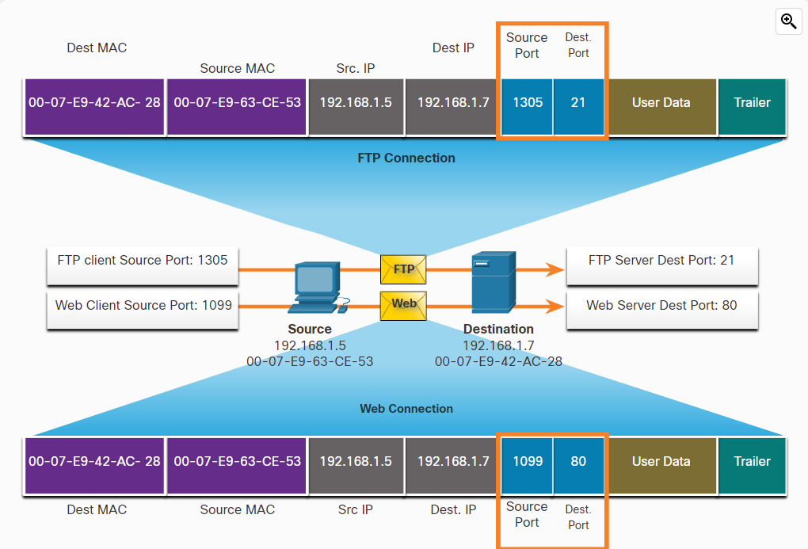
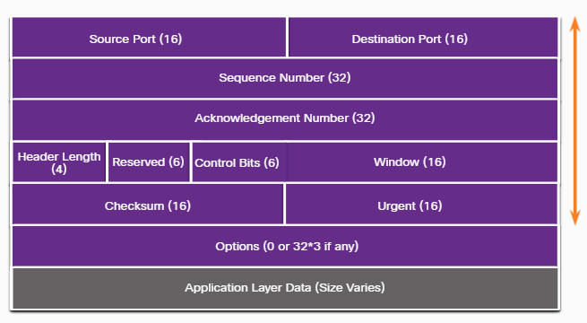
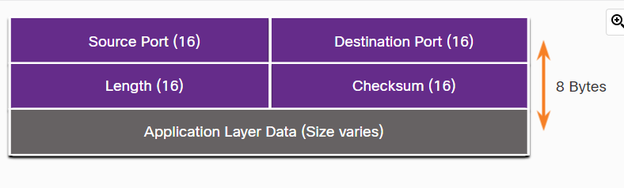
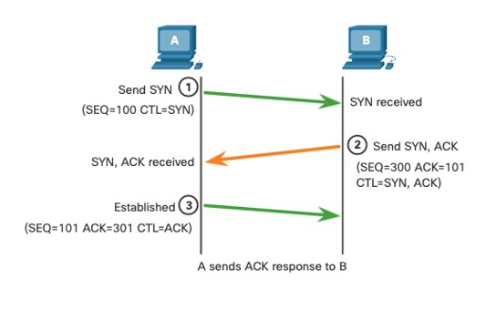
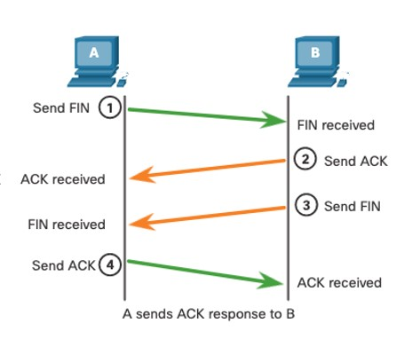

### Week 10  
- Module 26: Transport Layer                
- Module 15: TCP and UDP
> Checkpoint Exam: Protocols for Specific Tasks


| __Transport Layer / TCP vs UDP__ |                                          |
| -------------------------------- | ---------------------------------------- |
| Module 15: TCP and UDP           | 1.5.1 TCP vs. UDP                        |
| * TCP vs UDP                     | (connection-oriented vs. connectionless) |
| * Port Numbers                   |                                          |
|                                  |                                          |
| Module 26: Transport Layer       | 1.5.1 TCP vs. UDP                        |
| * TCP Header Fields              | (connection-oriented vs. connectionless) |
| * Applications that use TCP      |                                          |
| * UDP Header Fields              |                                          |
| * Applications that use UDP      |                                          |
| * Three-way Handshake            |                                          |
| * Data Loss and Retransmission   |                                          |
| * UDP Datagram Reassembly        |                                          |


## Transport Layer

* Responsible for network __transmission__.
* __Tracking individual conversations__
* __Identify, separate, and manage multiple conversations__
* Transport layer protocols __specify how to transfer messages between hosts__, and are responsible for managing __reliability__ requirements of a conversation.
* The transport layer includes the TCP and UDP protocols.

## TCP vs. UDP (connection-oriented vs. connectionless)

### Ports

* 0 - 1023 Well-know Ports
* 1024 - 49151 Registered Ports
* 49152 - 65535 Private Dynamic ports


| #       | Short Name   | TCP/UDP | Full Name                                 |
| ------- | ------------ | ------- | ----------------------------------------- |
| 20      | FTP -data    | TCP     | File Transfer Protocol (secure)           |
| 21      | FTP -control | TCP     | File Transfer Protocol (secure)           |
| **22**  | SSH          | TCP     | Secure Shell Protocol (remote connection) |
| 22      | SFTP         | TCP     | SSH File Transfer Protocol (secure)       |
| **23**  | TELNET       | TCP     | TELNET (remote connection)                |
| 25      | SMTP         | TCP     | Simple Mail Transfer Protocol (EMAIL)     |
| **53**  | DNS          | UDP     | Domain Name System (PAGINAS)              |
| 67      | DHCP -client | UDP     | Dynamic Host Configuration Protocol       |
| 68      | DHCP -server | UDP     | Dynamic Host Configuration Protocol       |
| 69      | TFTP         | UDP     | Trivial File Transfer Protocol (unsecure) |
| **80**  | HTTP         | TCP     | Hypertext Transfer Protocol (WEB SERVER)  |
| 110     | POP3         | TCP     | Post Office Protocol v3 (EMAIL)           |
| 143     | IMAP         | TCP     | Internet Message Access Protocol          |
| 161     | SNMP         | UDP     | Simple Network Management Protocol        |
| **443** | HTTPS        | TCP     | Hypertext Transfer Protocol Secure        |

# 15.2.3 Socket Pairs



# 15.2.4 The netstat Command


# TCP - Transmission Control Protocol (connection-oriented)
  - TCP is a __stateful__ protocol which means it keeps track (lleva registro) of the state of the communication session.
  - __Establishes a Session__
  - Ensures __Reliable__ Delivery 
  - Provides __Same-Order__ Delivery 
  - Supports Flow Control 
  - __Number and track__ data segments transmitted to a specific host from a specific application
  - __Acknowledge__ received data
  - __Retransmit__ any unacknowledged data after a certain amount of time
  - __Sequence data__ that might arrive in wrong order
  - Send data at an efficient rate that is acceptable by the receiver

## 26.2.2 TCP Header



### TCP Header Field Description 

* __Source Port__ A 16-bit field used to identify the source application by port number. 
* __Destination Port__ A 16-bit field used to identify the destination application by port number. 
* __Sequence Number__ A 32-bit field used for data reassembly purposes. 
* __Acknowledgment__ A 32-bit field used to indicate that data has been received and the next byte expected from the Number source. 
* __Header Length__ A 4-bit field known as "data offset" that indicates the length of the TCP segment header. 
* __Reserved__ A 6-bit field that is reserved for future use. 
* __Control bits__ A 6-bit field that includes bit codes, or flags, which indicate the purpose and function of the TCP segment. 
* __Window size__ A 16-bit field used to indicate the number of bytes that can be accepted at one time. 
* __Checksum__ A 16-bit field used for __error checking__ of the segment header and data. 
* __Urgent__ A 16-bit field used to indicate if the contained data is urgent. 


# UDP - User Datagram Protocol (connectionless)
  - Data is reconstructed in the order that it is received.
  - Any segments that are __lost are not resent__.
  - There is __no session establishment__.
  - The sending is not informed about resource availability.
  - UDP is a connectionless protocol. __stateless__ (no lleva registro)
  - UDP is known as a __best-effort__ delivery protocol because there is __no acknowledgment__ that the data is received at the destination.

## 26.3.2 UDP Header



### UDP Header Field Description 

* __Source Port__ A 16-bit field used to identify the source application by port number. 
* __Destination Port__ A 16-bit field used to identify the destination application by port number. 
* __Length__ A 16-bit field that indicates the length of the UDP datagram header. 
* __Checksum__ A 16-bit field used for __error checking__ of the datagram header and data. 


```
                      ┌──┐
     ┌────────────────┤IP├─────────────────┐
     │                └─┬┘                 │
   ┌─┴──┐             ┌─┴─┐              ┌─┴─┐
   │ICMP│             │TCP│              │UDP│
   └────┘             └───┘              └───┘
```
| ICMP         | TCP                 | UDP                 |
| ------------ | ------------------- | ------------------- |
| PING echo    | (retransmits)       | (Doesnt retransmit) |
| PING request | WEB traffic         | Audio and Video     |
|              | SecureConections    |                     |
|              | Three way handshake |                     |
|              | -HTTP 80            | -DNS 53             |
|              | -HTTPS 443          | -DHCP 67-68         |
|              | -SSH 22             | -TFTP 69            |
|              | -Telnet 23          |                     |


### TCP Three-Way Handshake 

- ACK > Acknowledgment flag used in connection establishment and session termination
- PSH > Push function
- RST > Reset the connection when an error or timeout occurs
- SYN > Synchronize sequence numbers used in connection establishment
- FIN > No more data from sender and used in session termination


### TCP Connection Establishment (Cortesia del Saludo)




### Session Termination (Cortesia de la despedida)



