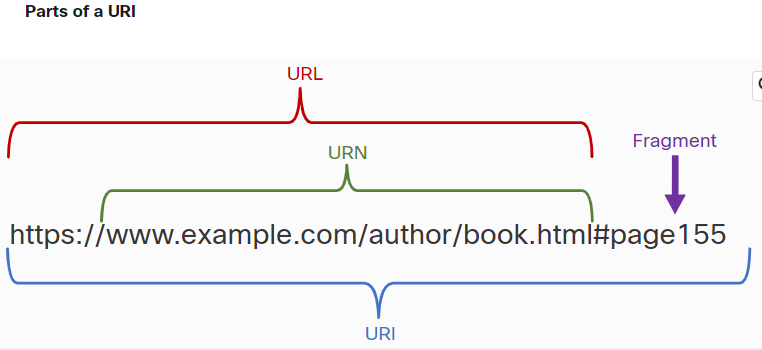
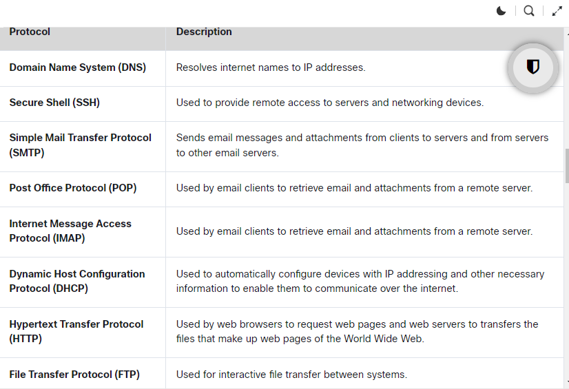

### Week 11  
- Module 7: The Access Layer              
- Module 16: Application Layer Services                                                  
- Module 25: IP Addressing Services
> Checkpoint Exam: Network Access


| __App Layer__                                  |             |
| ---------------------------------------------- | ----------- |
| Module 16: Application Layer Services          | 1.5.2 FTP   |
| * Client Server Relationship                   | 1.5.3 SFTP  |
| * URI, URN, and URL                            | 1.5.4 TFTP  |
| * DNS Servers                                  | 1.5.5 HTTP  |
| * HTTP and HTML                                | 1.5.6 HTTPS |
| * FTP                                          |             |
| * Telnet and SSH                               |             |
| * Email and Messaging                          |             |
| * 39.2.13                                      |             |
|                                                |             |
| Module 25: IP Addressing Services              | 1.5.7 DHCP  |
| * DNS Services                                 | 1.5.8 DNS   |
| * DHCP - DORA                                  |             |
|                                                |             |
| __*15-17 Exam: Protocols for Specific Tasks*__ |             |








| #   | Short Name      | TCP/UDP | Full Name                                    |
| --- | --------------- | ------- | -------------------------------------------- |
| 20  | *FTP* -data     | TCP     | File Transfer Protocol                       |
| 21  | *FTP* -control  | TCP     | File Transfer Protocol                       |
| 22  | *SFTP* -control | TCP     | Secure File Transfer Protocol                |
| 22  | **SSH**         | TCP     | Secure Shell Protocol (remote connection)    |
| 22  | **SCP**         | TCP     | SSH Secure Copy Protocol (secure)            |
| 23  | TELNET          | TCP     | TELNET (remote connection)                   |
| 25  | SMTP            | TCP     | Simple Mail Transfer Protocol                |
| 53  | **DNS**         | UDP     | Domain Name System (paginas amarilla)        |
| 67  | DHCP -client    | UDP     | Dynamic Host Configuration Protocol          |
| 68  | DHCP -server    | UDP     | Dynamic Host Configuration Protocol          |
| 69  | *TFTP*          | UDP     | Trivial File Transfer Protocol               |
| 80  | HTTP            | TCP     | Hypertext Transfer Protocol(websites)        |
| 110 | POP3            | TCP     | Post Office Protocol v3 (email)              |
| 143 | IMAP            | TCP     | Internet __Message__ Access Protocol (email) |
| 161 | **SNMP**        | UDP     | Simple __Network Management__ Protocol       |
| 443 | HTTPS           | TCP     | Hypertext Transfer Protocol Secure           |

# DHCP SERVER config 
```.txt
             ┌──────┐
             │Router│
             └───┬──┘
┌──────┐         │
│ DHCP │      ┌──┴─┐
│SERVER├──────┤SW01│
└──────┘      └┬───┤
               │   │
      ┌────┐   │   │  ┌────┐
      │PC01├───┘   └──┤PC02│
      └────┘          └────┘
```

# DHCP - Dynamic Host Configuration Protocol 
* UDP port 67  DHCP -client    
* UDP port 68  DHCP -server 

__Configure DHCP Server (packet tracer):__
* Services > DHCP > turn it on > Add a diferrent pool name > click Add > speficy:
    * a. Default Gateway (pool's Default Gateway): 192.168.10.1
    * b. DNS server (8.8.8.8)
    * c. Start IP address: 192.168.10.10 (ussually start at .10)
    * d. Subnet Mask: 255.255.255.0
    * e. Maximum Number of Users: (100)
    * f. WCL address (Wireless Lan Controller ip address) -- Optional (if needed)
    * g. Save


# DNS - Domain Name System (paginas amarillas)
* UDP port: 53

__DNS SERVER config (packet tracer):__
   * Services > DNS > turn it on > Add name and ip address > Add > Save
   * 142.250.189.142 == YOURNAME-store.com
   * 142.250.217.206 == drive.YOURNAME.com
   * nslookup (in WIN PC to check it out)


# HTTP and HTML
* TCP ports: 
    - HTTP: 80 - Hypertext Transfer Protocol
    - HTTPS: 443- Hypertext Transfer Protocol Secure

__WEB SERVER (packet tracer)__
    * Services > Http > turn it on > index.html > (edit) > change name from "Cisco packet tracer" to "YOURNAME-store.com" > Save


# FTP - File Transfer Protocol
* TCP port 20 -data
* TCP port 21 -control

__FTP SERVER (packet tracer):__
* FTP SERVER > Services > FTP > turn it on >  add a user and password, check the actions allow for the user: (Write, read, delete, rename, list) > click "Add" >

__From PC:__

Desktop > Text Editor > write a message > save it as "yourname-text.txt"

Desktop > Text Editor > Command Prompt
```bat
ftp 142.250.217.206
: access server:
: ftp <server URL or ip address>

?
: help (muestra comandos disponibles)

dir
: directory, muestra contenido del directorio/folder

put name-text.txt
: upload a file from your pc to the FTP server
: put "file name"

rename name-text.txt new-name-text.txt
: rename file
: rename "current name" "new name"

get new-name-text.txt
: Donwload a file from the FTP server to your pc

quit
: exit FTP server terminal
```

# TFTP - Trivial File Transfer Protocol
- UDP port 69

```ios
! Router1
copy tftp: flash: 
! copy a file from TFTP to flash(internal storage)
! Address or name of remote host []? 
192.168.10.10
! Source filename []? 
new-name-text.txt
! Destination filename [new-name-text.txt]? 
 <Enter>

dir
! check flash content

more new-name-text.txt
! display content "new-name-text.txt"
```

# SSH Secure Copy Protocol (SCP)   
- An extension of the Secure Shell protocol (SSH) version 2.0 to provide secure file transfer capabilities. 

```bat
scp filename.txt admin@0.0.0.0:~/filename.txt
: copiar filename.txt de "local PC" al host: "0.0.0.0",pack usando el usario: admin. pegar en "~/"(root directory)
: transfer, copy, move files using SSH
```

# Email Protocols

- SMTP - Simple Mail Transfer Protocol 
    * TCP port 25 
- POP3 - Post Office Protocol 
    * TCP port 110
- IMAP4 - Internet Message Access Protocol 
    * TCP port 143

## Packet tracer Samples:

- File > Open Samples > 01 Networking > Mail > mail_2Server_2PC.pkt