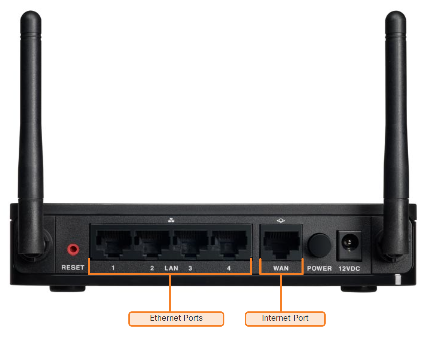

### Week 12   - 28 julio
- Module 3: Wireless and Mobile Networks                                              
- Module 4: Build a Home Network    
- Module 11: Dynamic Addressing with DHCP
- **Checkpoint Exam:** Build a Small Network
- **Checkpoint Exam:** The Internet Protocol
- **Checkpoint Exam:** ARP, DNS, DHCP and the Transport Layer

| __DHCP & ICMP__                                   |                            |
| ------------------------------------------------- | -------------------------- |
| Module 03: Wireless and Mobile Networks (lectura) | 3.2.0                      |
|                                                   | 3.2.1                      |
|                                                   | 3.2.2                      |
|                                                   | 3.2.3                      |
|                                                   | 3.2.4                      |
|                                                   |                            |
| Module 04: Build a Home Network                   | 6.3.0                      |
| * SSID                                            | 6.3.1                      |
| * "Ethernet-LAN ports" vs "internet-WAN ports"    | 6.3.2                      |
| > __*4.4.4 PT - Configure a Wireless Router*__    | 6.3.3                      |
| * MAC address filtering                           | 4.5.2                      |
|                                                   |                            |
| Module 11: Dynamic Addressing with DHCP           | 1.5.7 DHCP                 |
| * Static vs Dynamic Address Assignment            |                            |
| > __*11.2.3 PT - DHCP on a Wireless Router*__     |                            |
|                                                   |                            |


## 4.1.3 Typical Home Network Routers



### Ethernet Ports:
These ports connect to the internal switch portion of the router. These ports are usually labeled “Ethernet” or “LAN”, as shown in the figure. All devices connected to the switch ports are on the same local network.
### Internet Ports:
This port is used to connect the device to another network. The internet port connects the router to a different network than the Ethernet ports. This port is often used to connect to the cable or DSL modem in order to access the internet.

## WPA, WPA2, WPA3 (security)       

- WPA
    * (Wi-Fi Protected Access): WPA is a security protocol designed to secure wireless computer networks. It was introduced as an improvement over the original WEP (Wired Equivalent Privacy) protocol. WPA uses encryption methods to secure data transmitted over wireless networks.

- WPA2
    * is an updated and more secure version of WPA. It uses the Advanced Encryption Standard (AES) protocol and provides stronger data protection and network security compared to WPA. WPA2 has been the standard for securing Wi-Fi networks for many years.

- WPA3
    * is the latest security protocol for Wi-Fi networks, succeeding WPA2. It offers enhanced security features compared to WPA2, including stronger encryption.

## Choosing between Personal and Enterprise; 

* __Personal__ = LOCAL wifi_name and password (also called PSK: pre-shared key)
* __Enterprise__= REMOTE DATABASE user_name AND password

WIFI = 802.11 (IEEE)

## Wireless security concepts
- __SSID__ Broadcast (SSID = Service Set Identifier = Wifi name): Determines if the SSID will be broadcast to all devices within range. By default, set to Enabled.

## MAC address filtering
- use MAC address to limit access to a wifi network

---
# DHCP

## Static IPv4 Address Assignment

- __How to change IP address in Win10__: Settings > Network & Internet > change adapter option > right click in the NIC > 

* __IP address__ - This identifies the host on the network.
* __Subnet mask__ - This is used to identify the network on which the host is connected.
* __Default gateway__ - This identifies the networking device that the host uses to access the internet or another remote network.


## DHCP Servers:
```
┌───────┐                       ┌────────┐
│ My PC │          ┌──┬─────────┤  DHCP  │
└───────┴──────────┤SW│         │ SERVER │
                   └──┘         └────────┘
```
* Steps to Obtain a Lease

- DHCP Discover (DHCPDISCOVER) CLIENT
- DHCP Offer (DHCPOFFER) SERVER
- DHCP Request (DHCPREQUEST) CLIENT
- DHCP Acknowledgment (DHCPACK) SERVER

(port UDP numbers 67 server 68 client)


## APIPA (Automatic provisioning of IP Address)

* When DHCP fails: Link-local is assinged
* APIPA is (169.254.0.1 to 169.254.255.254) having 65,534 usable IP addresses, with the subnet mask of 255.255.0.0.
* An ip address is always used so PCs on same broadcast domain can comunicate 

# Configure DHCP on a Wireless Router:

__DHCP internal server (GUI):__
    - Setup > Basic setup > DHCP server Settings

